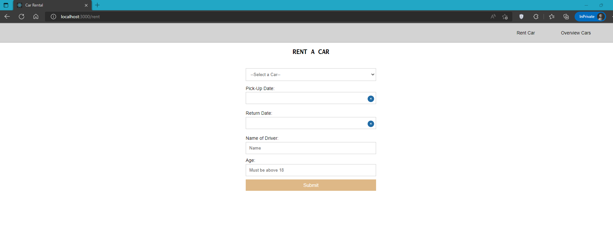
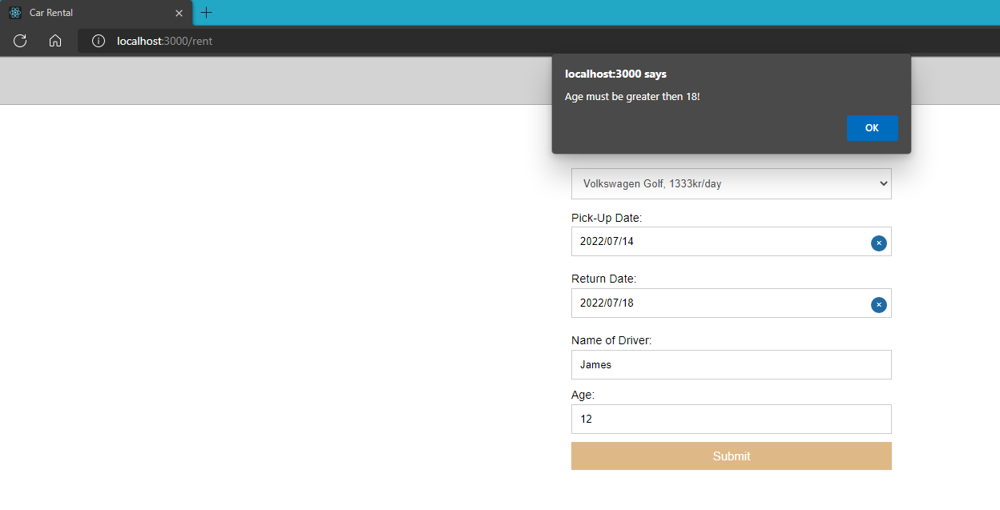
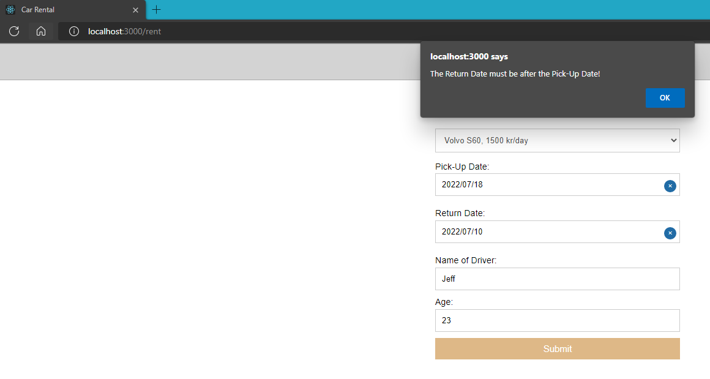
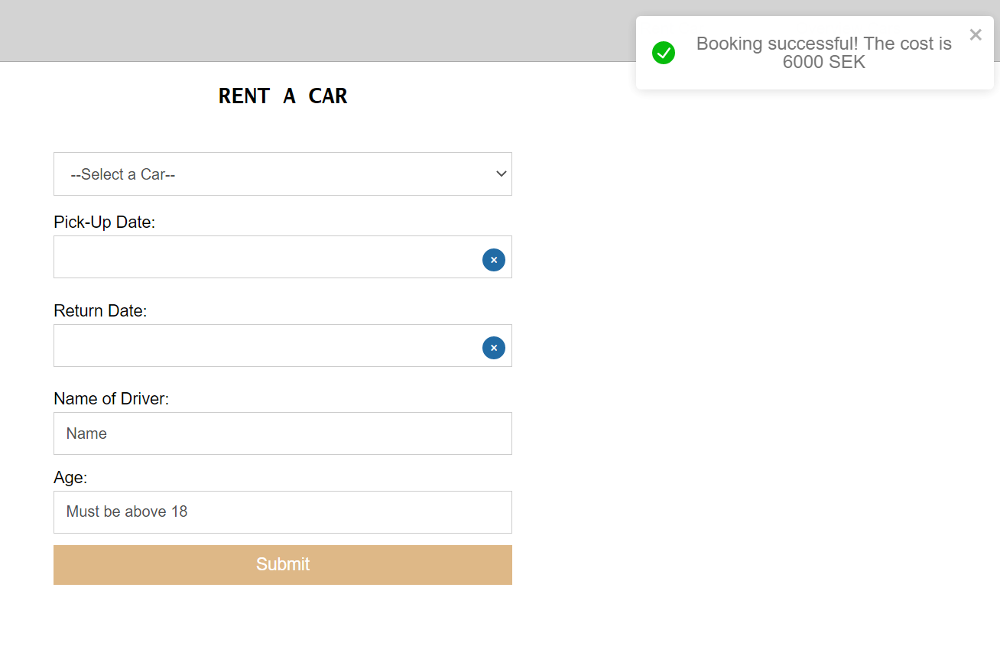
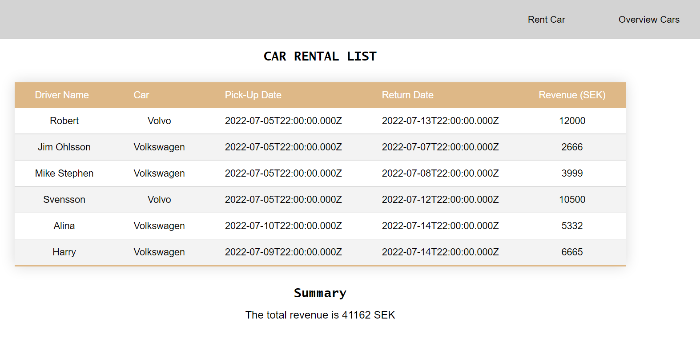
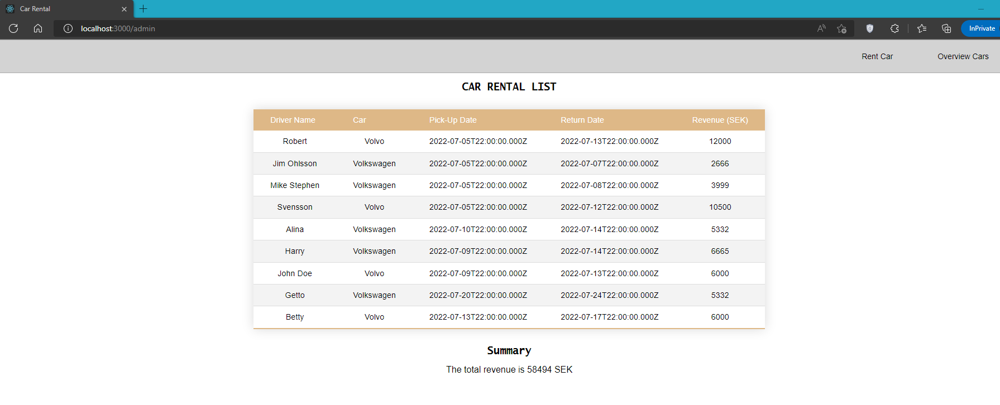
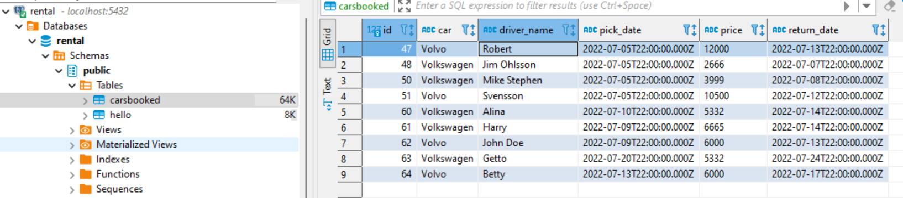

# Welcome to Car Rental bootstrap project

This is a minimal application for renting cars where the user is presented with two views. **View 1** is `/rent` where the user can create a booking for the car. **View 2** is the `/admin` view where a list of all the bookings that were made can be seen. <br/>
The purpose of this application is to demonstrate how Full Stack applications are developed using REST API, Clean Code and Object-Oriented Programming paradigm. The MVC pattern was used in the backend and the JUnit tests were performed to check if the test pass and the application works as intended. The following technologies, libraries, and frameworks were used in this project:
* **_Frontend:_** React Js, Axios, CSS, HTML, eslint, Prettier and JavaScript
* **_Backend:_** Java Spring Boot 
* **_Database:_** PostgreSQL

### Pre-requisites ### 
* Java 18
* Maven 
* Docker for easy setup of database
* Node 16 LTS 
* NPM installed 

## Configuration and Walkthough

#### 1. Clone the repo

**Method 1:** Clone 
~~~
clone https://github.com/np222gb/Car-Rental.git
~~~
**Method 2:** Download the project 


#### 2. Set up the database
**Method 1:** The database can be setup by entering the following docker command based on the [Bitnami PostgreSQL Image](https://hub.docker.com/r/bitnami/postgresql/):

`docker run --name postgresql -p 5432:5432 -e POSTGRESQL_USERNAME=my_user -e POSTGRESQL_PASSWORD3=password12 -e POSTGRESQL_DATABASE=rental bitnami/postgresql:latest`

**Method 2:** In spring boot, go to the file `application.properties` in the `resources` folder and change the database configuration by entering your database credentials like the database name, username and password.
```` 
spring.datasource.url=jdbc:postgresql://localhost:5432/{your datatbase name}
spring.datasource.username={ username }
spring.datasource.password={ password }
spring.jpa.hibernate.ddl-auto=update
````

#### 3. Start the backend 
The backend source code was bootstrapped with [Spring initializr](https://start.spring.io/) and is configured to run against a PostgreSQL database. 

* Start the backend by running  `com.example.rental.RentalApplication#main`.


#### 4. Start the frontend
The frontend was bootstrapped with [Create React App](https://github.com/facebook/create-react-app).

The `package.json` contains npm commands. The `package.json` has a proxy for the backend hosted at `http://localhost:8080`.

* Choose the `frontend` directory and use `npm install`  to install all dependencies.
* Then use `npm start` to run the client side of the application and open [http://localhost:3000](http://localhost:3000).

#### 5. Use the application
- If the backend, frontend and the database are correctly configured then the application should be up and running.
- The homepage shows "RENT A CAR" form where the user can create car bookings by correctly entering all the required details. This page is served on localhost and can also be accessed by using URL `http://localhost:8080/rent` .
- The application can be navigated to "CAR RENTAL LIST" by clicking the `Overview Cars` option in the top right corner of the navbar. It displays all the bookings that were previously made by fetching from them from the database. This page can also be accessed by using URL `http://localhost:8080/admin` . 

#### 6. Further information
 * The application contains test cases within the `test` directory in the backend code. 
 * To run the test, run the class `RentalApplicationTests`  which executes the necessary tests.
 * The `\admin` page also shows the total revenue earned from all the bookings and updates automatically when a new booking is made.
 * If the user makes a successful booking, a toast message is displayed showing that the booking was successful along with the cost of the booking. 
 * The application presents error messages in the form of alerts when incorrect details are entered. 
 * For instance, if age is less than 18 or if some inout fields are empty then it shows error messages.
 * The DEMO images show the functionalities of the application while running and its results. 

#### 7. DEMO
* The Rent View: contains all the required input fields for creating a booking such as the car type with prices, driver name, age, pick up and return date. Its relative URL is `/rent` 
   
* The Rent View: input fields are validated on the given input. The driver's age must be greater than 18 else an error alert message is shown.
   
* The Rent View: validates if the return date of car is after the pickup date or else an error alert message is shown.
   
* The Rent View: presents a success toast message for a brief time which contains the cost of booking if the details are entered correctly. 
   
* The Admin view: presents all the bookings that were made by fetching them from the database. It also shows a summary of the total revenue. Its relative URL is `/admin`
   
* The Admin View: updates the total revenue when more cars are rented.
   
* The Database schema 
   

### Information:
Author: Nitin Pasikanti <br>
&copy; 2022 Nitin Pasikanti